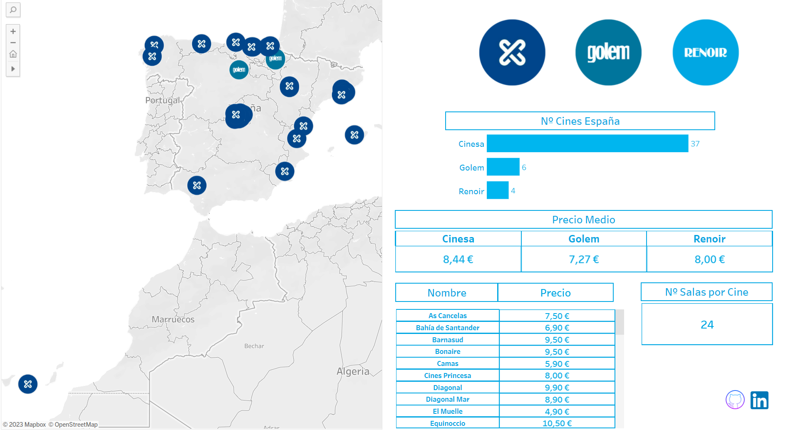

# Cinema Finder in Spain

This is a Tableau project that displays cinemas in Spain, their prices, the movie theaters, and links to the films in theaters. The data was extracted from cinema websites using Python and Selenium. The objective is to continue growing both in terms of cinema chains and the number of cinemas.

## Table of Contents
1. [Technologies used](#technologies-used)
2. [How to use](#how-to-use)
3. [Data sources](#data-sources)
4. [Author](#support)

## Technologies used

- Python 3.7+
- Tableau Desktop
- Selenium
- pandas
- requests
- re
- unicodedata
- tqdm
- webdriver_manager

## How to use

1. Clone the repository to your local machine.
2. Install the necessary Python packages using `pip install -r requirements.txt`.
3. Run the `Merge.ipynb` script to extract cinema data from the web and generate CSV files.
4. Open the Tableau project file [Cines](https://public.tableau.com/app/profile/jc1027/viz/Cines/Mapa?publish=yes) in Tableau Desktop.
5. Connect to the CSV files generated by the Python script.
6. Build your own visualizations and dashboards in Tableau to explore the cinema data in Spain!

## Data sources

The data was extracted from the following cinema websites:

- Cinesa
- Golem
- Renoir

## Author

This has been created to display all the information related to cinemas in Spain. Next steps, try to add new cinema chains, insert provinces so you can filter all the cinemas per province in Spain... If you have any questions or feedback, please contact me at juanoncorrea@gmail.com.